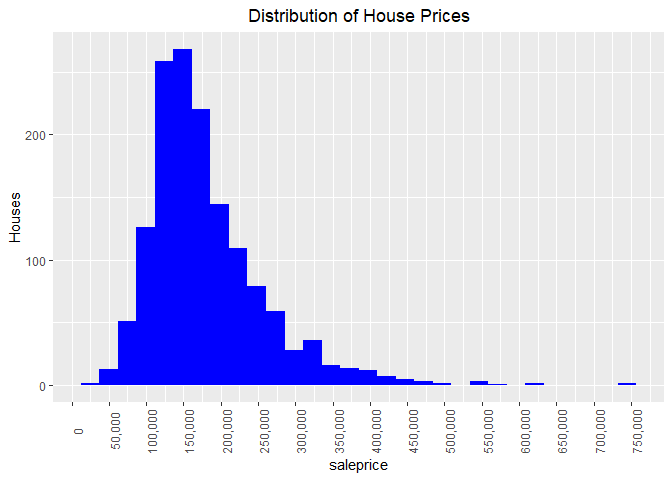
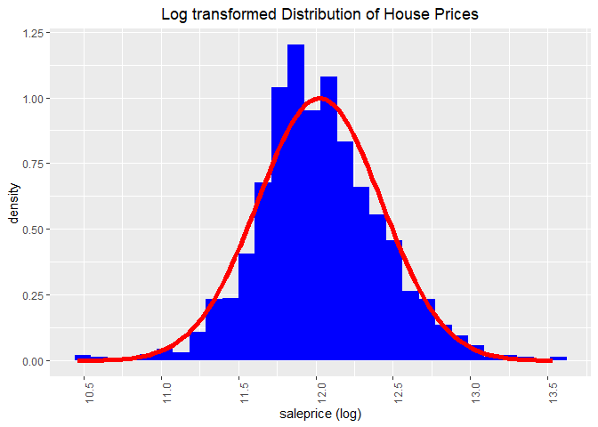
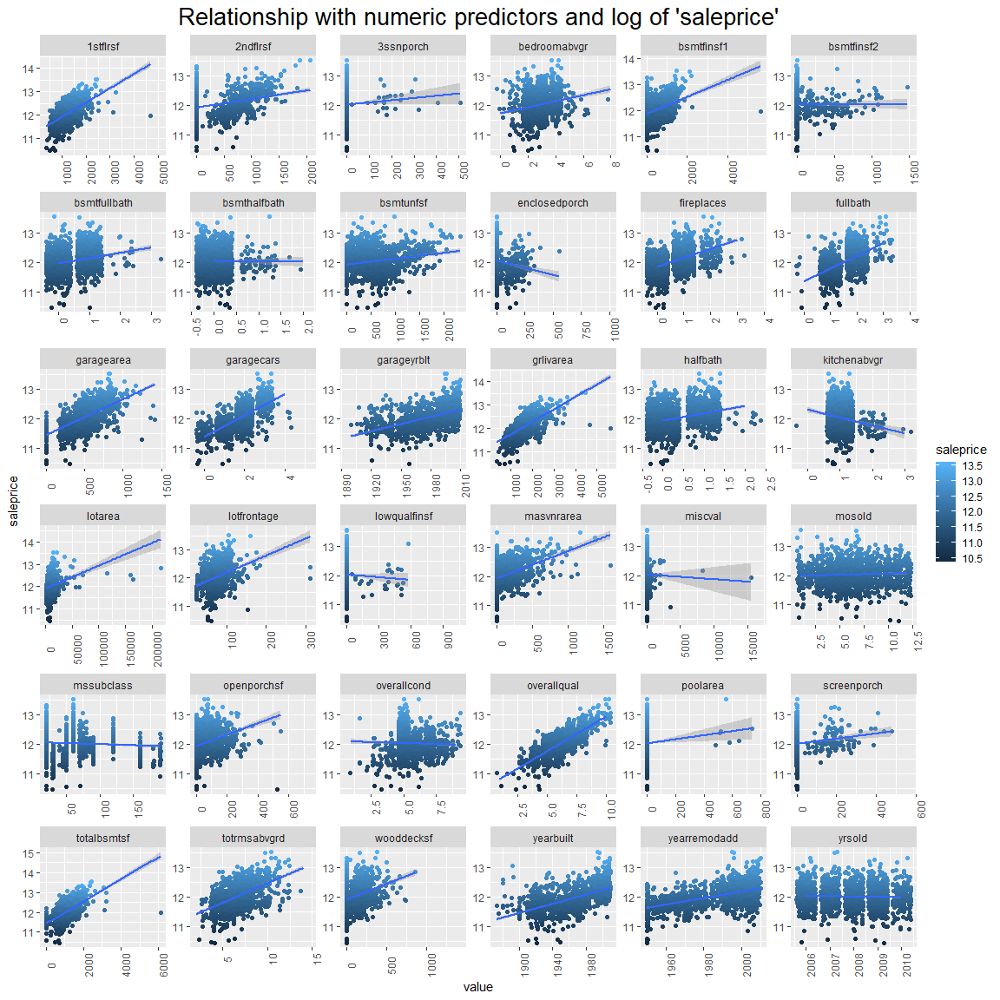

Feature Importance: Predictive Power Score
================
registea
13/07/2020

<center>


</center>

# Introduction

This notebook explores the Predictive Power Score (PPS) filter method
created by Florian Wetschoreck and posted on
[Medium](https://towardsdatascience.com/rip-correlation-introducing-the-predictive-power-score-3d90808b9598).
The article describes the PPS as a data type agnostic normalised score
of predictive power. The example in the article provided was written in
python, this notebook implements the PPS in R, via a custom function.

To explore the PPS, the house price prediction
[dataset](https://www.kaggle.com/c/house-prices-advanced-regression-techniques)
from kaggle is used. This dataset is relatively large from a dimensional
perspective but relatively small with regards to observations.

This notebook will not focus on the exploratory analysis or feature
engineering steps in the model building process, but jump directly to
evaluating variable importance using this metric. If you are interested
in a full analysis of this dataset, then please follow this link to my
kaggle
[kernal](https://www.kaggle.com/ar89dsl/house-price-eda-predictive-power-score).

# Exploring the target Variable ‘saleprice’

The histogram shows the distribution of the ‘saleprice’ variable across
all house sales. We can see that the majority of houses are around 150k
in price, this is confirmed by calculating the median which sits at
163k. The data has a long tail to the right, indicating that there are a
small number of high priced houses. The skewness of house prices is
1.88, as this is above 1 it indicates that the data is highly positively
skewed.



Applying a log transformation to the ‘saleprice’ variable makes the the
data more symetrical and reduces the skew to 0.12. A skewness value
between 0 and 0.5 indicates it is now minimally skewed. This can be
visualised below in the historgram, in which the distribution appears to
be a closer representation of a normal distribution. The log
transformation has been explored here but will be applied in a later
section.



# Feature Selection via Feature Importance

A high dimensional dataset can be very useful for prediction, the
numerous combinations of predictors can be utilised by a model to
accurately predict a target of interest. There are also drawbacks of
having a large feature set, these primarily are on computation time and
resources. It some cases multiple predictors contain similar features or
have no meaninful relationship with the target variable. In these cases,
the addiitonal features can have adverse effects on model performance.
There are a few different approaches to selecting features, one of the
simplest is using a filter approach. This approach, measures the
relationship between an individual predictor and the target variable. It
is simple, because it is evaluated without reference to other
predictors, which it may have a meaningful relationship with.

## Introducing Predictive Power Score (PPS)

A comprehensive breakdown of the PPS can be found
[here](https://towardsdatascience.com/rip-correlation-introducing-the-predictive-power-score-3d90808b9598)
where Florian Wetschoreck introduces the approach. It is delicately
summarised as *“an asymmetric, data-type-agnostic score for predictive
relationships between two columns that ranges from 0 to 1”*. A score of
0 indicates the independent variable has no relationship with the target
and a score of 1 indicates a perfect relationship of predictive power.
The approach uses a naive model and a evaluation metric (RMSE in this
case), the naive model sits as the upper bound (worst case possible) and
the individual predictor is evaluated with reference to how well it
predicts in relation to the naive model.

The function ‘f\_PPS’ built below, is the implementation of the PPS
score and is summarised in the following way:

  - Creates a two variable dataframe containing a single predictor and
    target variable
  - Pre-process numerical data with normalisation or creating dummy
    variables for nominal data
  - Builds a Cross Validated (CV) hyperparameter tuned decision tree and
    predicts on validation data
  - Creates a naive model to be stored as the upper bound, in this case
    using the just the median ‘saleprice’
  - Compare decision tree evaluation metric with naive model in a
    normalisation function (.pred - UB) / (LB - UB) to restrict the
    score between 0 and 1

<!-- end list -->

``` r
# Predictive Power Score Function
f_PPS <-
  function(predictor, target, model_mode,
           evaluation_metric, LB,
           grid_size, folds,
           seedval = 1989)
  {

    # Combine predictor and target variable from inputs
    df <-
      data.frame(predictor = predictor,
                 target = target
                 )

    # Add pre-processing steps
    recipe <-
      df %>%
        recipe(target ~ .) %>%
        step_dummy(all_nominal(), -all_outcomes()) %>%
        prep()

    # Apply transformation
    df <- recipe %>% bake(df)

    # Cross validation
    set.seed(seedval) # set the seed
    l_cv <- vfold_cv(df, v = folds, strata = "target") # Cross validation

    # Set the model engine
    mod <-
      decision_tree(mode = model_mode,
                    cost_complexity = tune(),
                    tree_depth = tune(),
                    min_n = tune()
                    ) %>%
      set_engine("rpart")

    # Evaluation metric
    if(evaluation_metric == "rmse") {
      metric_eval <- "rmse"
      metric_focus <- yardstick::metric_set(rmse)
    } else if (evaluation_metric == "mae") {
      metric_eval <- "mae"
      metric_focus <- yardstick::metric_set(mae)
    } else if (evaluation_metric == "mape") {
      metric_eval <- "mape"
      metric_focus <- yardstick::metric_set(mape)
    } else {
      metric_eval <- "rmse" # default
      metric_focus <- yardstick::metric_set(rmse)
    }

    # Hyperparameter tuning and store parameters
    set.seed(seedval) # set the seed
    df_parameter <-
      tune_grid(
                formula   = target ~ .,
                model     = mod,
                resamples = l_cv,
                grid      = grid_random(parameters(cost_complexity(),
                                                   tree_depth(),
                                                   min_n()),
                                        size = grid_size),
                metrics   = metric_focus,
                control   = control_grid(verbose = FALSE)
          ) %>%
      select_best(metric_eval)

    # CV Optimised Model
    mod_final <-
      list(parameters = df_parameter,
           df = map2_df(.x = l_cv$splits,
                        .y = l_cv$id,
                        function (split = .x, fold = .y)
                         {
                           # Split the data into analysis and assessment tables
                           df_analysis <- analysis(split)
                           df_assessment <- assessment(split)

                           # Build the model
                           mod_2 <-
                            decision_tree(mode = model_mode,
                                          cost_complexity = as.numeric(df_parameter["cost_complexity"]),
                                          tree_depth = as.numeric(df_parameter["tree_depth"]),
                                          min_n = as.numeric(df_parameter["min_n"])
                                         ) %>%
                             set_engine("rpart") %>%
                             fit(target ~ ., data = df_analysis)

                           # Summarise Predictions
                           table <-
                             tibble(fold = fold,
                                    truth = df_assessment$target,
                                    .pred = predict(mod_2, new_data = df_assessment) %>% unlist()
                                    )
                            })
              )

    # Predict using the model and naive approach
    df_output <- # upper bound alignment
        data.frame(truth = target, # actual house price
                   .naive = median(target)
                   )
    

    # Calculate the upper bound and predictive score
    if(evaluation_metric == "rmse") { 
      
      # Calculate rmse for naive model
      UB <-
        df_output %>%
        rmse(truth, .naive) %>%
        select(.estimate) %>%
        as.numeric()
      
      # Calculate rmse for tuned decision tree
      pred <-
        mod_final[["df"]] %>%
        rmse(truth, .pred) %>%
        select(.estimate) %>%
        as.numeric() 
      
    } else if (evaluation_metric == "mae") {
      
      # Calculate mae for naive model
      UB <-
        df_output %>%
        mae(truth, .naive) %>%
        select(.estimate) %>%
        as.numeric()
      
      # Calculate mae for tuned decision tree
      pred <-
        mod_final[["df"]] %>%
        mae(truth, .pred) %>%
        select(.estimate) %>%
        as.numeric()     
      
    } else if (evaluation_metric == "mape") {
      
      # Calculate mape for naive model
      UB <-
        df_output %>%
        mape(truth, .naive) %>%
        select(.estimate) %>%
        as.numeric()
      
      # Calculate mape for tuned decision tree
      pred <-
        mod_final[["df"]] %>%
        mape(truth, .pred) %>%
        select(.estimate) %>%
        as.numeric() 
 
    } else {
      
      # Calculate rmse for naive model
      UB <-
        df_output %>%
        rmse(truth, .naive) %>%
        select(.estimate) %>%
        as.numeric()
      
      # Calculate rmse for tuned decision tree
      pred <-
        mod_final[["df"]] %>%
        rmse(truth, .pred) %>%
        select(.estimate) %>%
        as.numeric()  
    }

    # Calculate PPS score
    PPS <- (pred - UB) / (LB - UB)
    
    # Return PPS score
    return(PPS)

    }
```

Now that we have a PPS function set-up, the output can be tested on a
handful of variables. A quick visual correlation analysis is run on the
numerical variables to choose some variables which exhibit strong and
weak linear relationships.



The following two variables are chosen:

  - overallqual: Numerical variable which plot indicates strong positive
    correlation
  - miscval: Numerical variable which the EDA indicated near zero
    variance

The table below shows that none of the variables in their own right have
a particularly high PPS score. However, the two variables indentified as
being important (overallqual, garagefinish) seem to have a relatively
high score, while miscval and utilities are virtually 0.

|  Variable   |  PPS  |
| :---------: | :---: |
| overallqual | 42.5% |
|   miscval   | 0.2%  |
