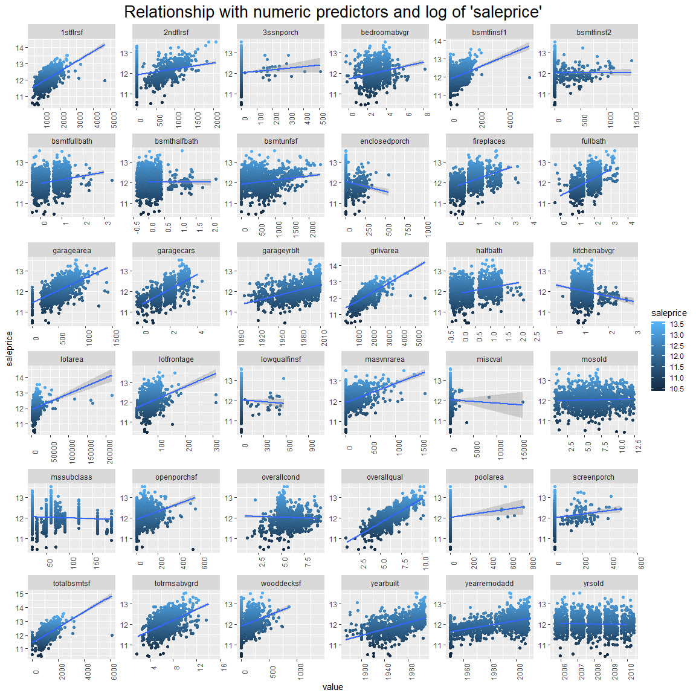

Feature Importance: Predictive Power Score
================
registea
13/07/2020

# Introduction

This notebook explores the Predictive Power Score (PPS) filter method
created by Florian Wetschoreck and posted on
[Medium](https://towardsdatascience.com/rip-correlation-introducing-the-predictive-power-score-3d90808b9598).
The article describes the PPS as a data type agnostic normalised score
of predictive power. The example in the article provided was written in
python, this notebook implements the PPS in R, via a custom function.

To explore the PPS, the house price prediction
[dataset](https://www.kaggle.com/c/house-prices-advanced-regression-techniques)
from kaggle is used. This dataset is relatively large from a dimensional
perspective but relatively small with regards to observations.

This notebook will not focus on the exploratory analysis or feature
engineering steps in the model building process, but jump directly to
evaluating variable importance using this metric. If you are interested
in a full analysis of this dataset, then please follow this link to my
kaggle
[kernal](https://www.kaggle.com/ar89dsl/house-price-eda-predictive-power-score).

# Exploring the target Variable ‘saleprice’

The histogram shows the distribution of the ‘saleprice’ variable across
all house sales. We can see that the majority of houses are around 150k
in price, this is confirmed by calculating the median which sits at
163k. The data has a long tail to the right, indicating that there are a
small number of high priced houses. The skewness of house prices is
1.88, as this is above 1 it indicates that the data is highly positively
skewed.

Applying a log transformation to the ‘saleprice’ variable makes the the
data more symetrical and reduces the skew to 0.12. A skewness value
between 0 and 0.5 indicates it is now minimally skewed. This can be
visualised below in the historgram, in which the distribution appears to
be a closer representation of a normal distribution. The log
transformation has been explored here but will be applied in a later
section.

